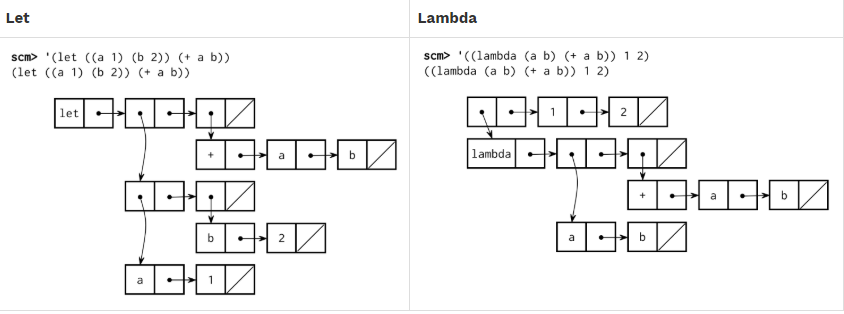

An interpreter for a subset of the Scheme language completed for CS61A.

scheme.py: the Scheme evaluator

scheme_reader.py: the Scheme syntactic analyzer 

questions.scm: a collection of functions written in Scheme 

tests.scm: a collection of test cases written in Scheme 

scheme_tokens.py: a tokenizer for Scheme 

scheme_primitives.py: definitions for primitive Scheme procedures

buffer.py: a Buffer implementation, used in scheme_reader.py
